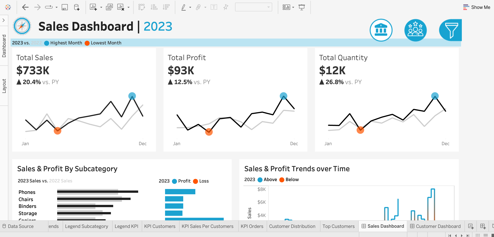
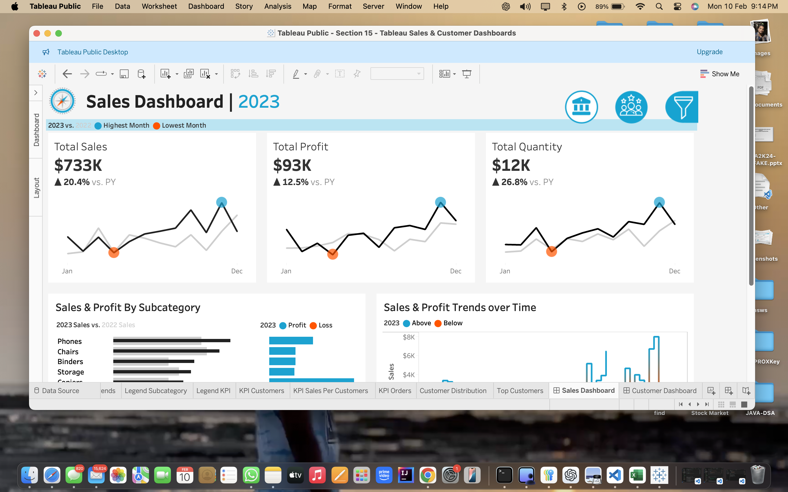
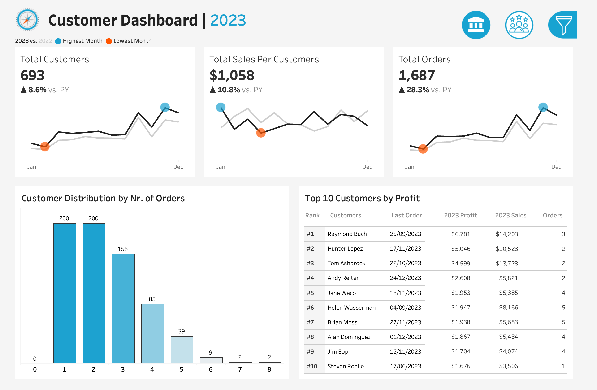
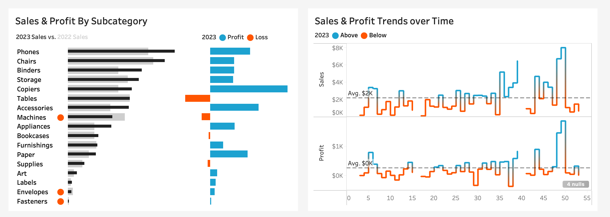

# 📊 Sales and Customer Performance Dashboards

## 🚀 Overview

The **Sales and Customer Performance Dashboards** project provides comprehensive insights into sales metrics and customer behavior through **interactive Tableau visualizations**. This project summarizes key metrics like **sales, profits, quantities,** and **customer engagement**, offering detailed analyses across different time periods and product categories.

---

## 🌟 Features

### 📈 Sales Summary  
- In-depth overview of **sales, profits,** and **quantities** for current and previous years.
- Clear visualization of growth trends and performance highlights.

### 👥 Customer Insights  
- Analysis of **customer count**, **sales per customer**, and **order count trends**.
- Identify high-value customers and engagement patterns.

### 🗂️ Interactive Dashboards  
- Explore **monthly trends**, **subcategory comparisons**, and **weekly performance**.
- Dynamic charts with filtering options for **product category**, **subcategory**, and **location**.

### 📊 Historical Data Analysis  
- **Year selection** feature to explore historical data trends.
- Compare performance across different periods seamlessly.

---

## 🛠️ Technologies Used

- **Tableau:** For creating interactive visualizations and dashboards.
- **SQL:** Data querying and management for underlying data sources.
- **Excel:** Data preprocessing and analysis for supplementary data insights.

---

## 💡 Conclusion

This project empowers businesses to make **data-driven decisions** by visualizing key performance indicators, identifying trends, and enhancing customer insights through powerful Tableau dashboards.

---

✅ *Explore. Analyze. Succeed.*

